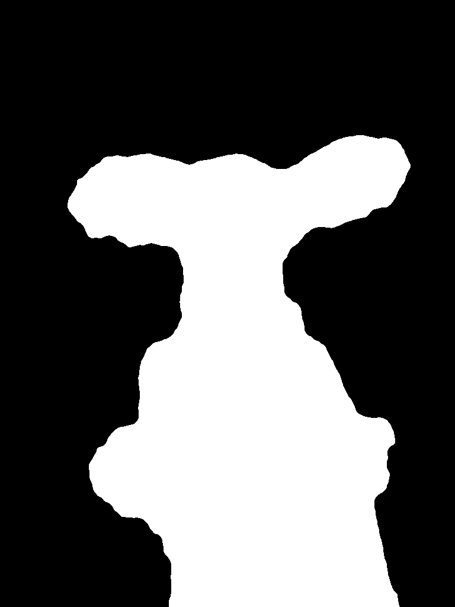
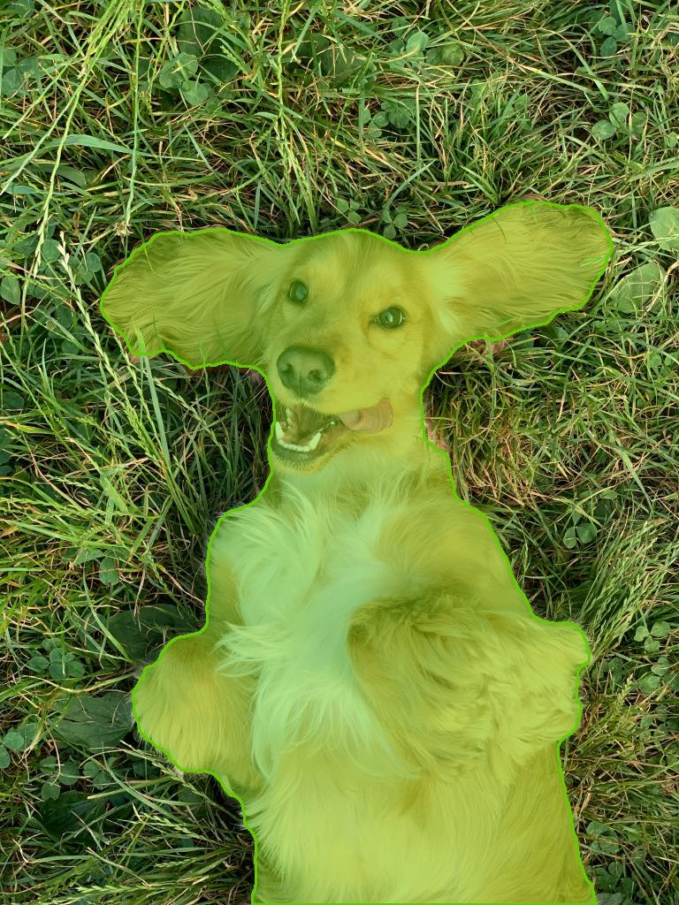

# PhotoSAM

> **Interactive AI subject segmentation** powered by [Meta SAM2](https://github.com/facebookresearch/segment-anything-2).  
> Click any object in a photo — get a refined mask, an overlay, and a transparent PNG cutout in seconds.

---

## Demo

**Input → Mask → Overlay → Transparent cutout** (single click on subject)

| Original | Binary Mask | Overlay | Cutout |
|----------|-------------|---------|--------|
|  | .png) | .jpg) | .png) |
|  |  |  |  |

---

## Features

| Feature | Description |
|---------|-------------|
| **Single-click segmentation** | Click any pixel to select the subject — no bounding box or brush needed |
| **SAM2 inference** | Meta's `sam2-hiera-tiny` — fast, accurate, runs on CPU |
| **Mask refinement** | Morphological open/close + flood-fill + Gaussian smoothing via OpenCV |
| **Three outputs** | Binary mask · Colour overlay · Transparent PNG cutout |
| **One-click download** | Download each output directly from the UI |
| **REST API** | FastAPI backend with Swagger docs at `/docs` |
| **Mock mode** | Full-pipeline testing without the SAM2 model — no GPU required locally |
| **Env-var backend** | Single `BACKEND_URL` switches between local, Colab, and HF Spaces |

---

## Architecture

```
┌─────────────────────┐         HTTP (multipart)         ┌─────────────────────┐
│  Streamlit Frontend │  ─────────────────────────────▶  │   FastAPI Backend   │
│      app.py         │  ◀─────────────────────────────  │  backend/main.py    │
└─────────────────────┘          JSON response            └──────────┬──────────┘
                                                                     │
                                          ┌──────────────────────────┼──────────────────────┐
                                          ▼                          ▼                      ▼
                                   preprocess.py            inference.py           postprocess.py
                                   • Validate               • SAM2 predictor       • Morphology
                                   • BGR→RGB                • Point prompt         • Overlay
                                   • Resize                 • Best mask            • Alpha PNG
```

---

## Project Structure

```
PhotoSAM/
├── app.py                  ← Streamlit frontend
├── download_model.py       ← Downloads SAM2 checkpoint
├── requirements.txt        ← Full deps (GPU / Colab)
├── requirements-local.txt  ← Local deps, no SAM2 git install
├── .env.example
│
├── backend/
│   ├── main.py             ← FastAPI app factory + lifespan
│   ├── routes.py           ← GET /health · POST /segment
│   ├── inference.py        ← SAM2 predictor wrapper (+ mock fallback)
│   ├── preprocess.py       ← Validate · resize · BGR→RGB
│   ├── postprocess.py      ← Morphology · overlay · transparent PNG
│   ├── config.py           ← All tuneable settings
│   └── utils.py            ← Base64 helpers · file I/O
│
├── models/                 ← Checkpoint lives here (git-ignored)
├── outputs/                ← Runtime outputs (git-ignored)
├── tests/
│   ├── test_api.py         ← FastAPI integration tests
│   └── test_utils.py       ← Utility + postprocess unit tests
└── examples/
    ├── input/              ← Sample input images
    └── output/             ← Sample output images
```

---

## Quick Start

### Prerequisites

- Python 3.10+
- Git

### 1 — Clone

```bash
git clone https://github.com/your-username/PhotoSAM.git
cd PhotoSAM
```

### 2 — Install dependencies

**Local development** (no GPU needed — runs in mock mode):
```bash
pip install -r requirements-local.txt
```

**GPU machine** (Colab, cloud VM):
```bash
pip install torch torchvision --index-url https://download.pytorch.org/whl/cu121
pip install -r requirements-local.txt
pip install 'sam2 @ git+https://github.com/facebookresearch/segment-anything-2.git'
```

### 3 — Download the SAM2 checkpoint

```bash
python download_model.py
```

Downloads `sam2_hiera_tiny.pt` (~38 MB) into `models/`.  
Skip this step for local mock-mode development.

### 4 — Start the backend

```bash
uvicorn backend.main:app --reload --port 8000
```

Swagger UI → [http://localhost:8000/docs](http://localhost:8000/docs)

### 5 — Start the frontend

```bash
streamlit run app.py
```

Open [http://localhost:8501](http://localhost:8501) in your browser.

---

## Environment Variables

Copy `.env.example` to `.env`:

```env
BACKEND_URL=http://localhost:8000

# BACKEND_URL=https://xxxx.ngrok-free.app     # Colab
# BACKEND_URL=https://your-username-photosam.hf.space  # HF Spaces
```

| Variable | Default | Description |
|----------|---------|-------------|
| `PHOTOSAM_DEVICE` | `auto` | `cuda` or `cpu` |
| `PHOTOSAM_MAX_SIZE` | `1024` | Max image dimension before resize |
| `PHOTOSAM_MAX_UPLOAD_MB` | `20` | Upload size limit |

---

## API Reference

### `GET /health`

```json
{
  "status": "healthy",
  "model_loaded": true
}
```

### `POST /segment`

**Request** (`multipart/form-data`):

| Field | Type | Description |
|-------|------|-------------|
| `image` | File | JPEG or PNG image |
| `click_x` | int | Horizontal pixel coordinate (original image space) |
| `click_y` | int | Vertical pixel coordinate (original image space) |

**Response**:

```json
{
  "mask":             "<base64 PNG>",
  "overlay":          "<base64 JPEG>",
  "transparent_png":  "<base64 PNG>",
  "inference_time":   0.87,
  "total_time":       0.95,
  "mask_area":        32.6,
  "confidence_score": 0.9821,
  "image_size":       [480, 640]
}
```

---

## Internal Pipeline

```
Upload Image
    │
    ▼
Validate (MIME type · size · bounds)
    │
    ▼
Decode (OpenCV) · BGR→RGB · Resize (≤1024px)
    │
    ▼
SAM2 Predictor ← positive point prompt (x, y)
    │
    ▼
Choose best mask (highest confidence score)
    │
    ▼
Morphological Closing  → fill holes
Morphological Opening  → remove blobs
Largest component      → keep subject
Flood-fill             → fill interior holes
Gaussian smooth        → anti-alias edges
    │
    ├──▶ Binary mask PNG
    ├──▶ Colour overlay JPEG
    └──▶ Transparent cutout PNG
    │
    ▼
JSON Response
```

---

## Running Tests

```bash
pytest tests/ -v
```

Tests run without the SAM2 model — the inference engine activates mock mode automatically when the checkpoint is missing.

---

## Colab (GPU Inference)

To run real SAM2 inference without a local GPU:

1. Open a new Colab notebook
2. Install SAM2, download the checkpoint, start FastAPI with uvicorn, expose via ngrok
3. Copy the ngrok URL into your local `.env` as `BACKEND_URL`
4. Run `streamlit run app.py` locally — it now talks to the Colab GPU

---

## Model Choice

| Model | Params | Speed (CPU) | Quality |
|-------|--------|-------------|---------|
| `sam2-hiera-tiny` ✅ | 38M | ~1–2s | Good |
| `sam2-hiera-small` | 46M | ~2–4s | Better |
| `sam2-hiera-large` | 224M | ~10s+ | Best |

`sam2-hiera-tiny` was chosen for CPU viability and low memory footprint.

---

## Stack

`Python` · `FastAPI` · `SAM2` · `PyTorch` · `OpenCV` · `Streamlit` · `Pillow` · `NumPy`

---

## License

This project is released under the [MIT License](LICENSE).  
Meta SAM2 is released under the [Apache 2.0 License](https://github.com/facebookresearch/segment-anything-2/blob/main/LICENSE).
